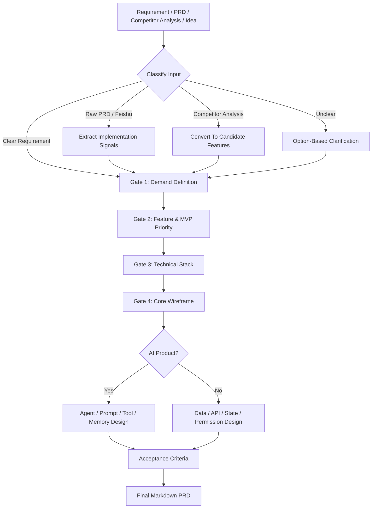

# Vibe Coding PRD Skill

> 把需求、原始 PRD、竞品分析、飞书文档或模糊想法，提炼成可以直接交给 Claude Code / Codex 的编码 Agent PRD。


## What It Does

This skill turns messy product input into a concise, implementation-ready Markdown PRD for coding agents.

| Input | What the skill does | Output |
|---|---|---|
| Clear requirement | Confirms scope, priority, stack, and UI | Coding-ready PRD |
| Raw PRD | Removes business noise and keeps engineering signals | Implementation PRD |
| Feishu/Lark doc | Reads source through Lark tools when available | Extracted PRD |
| Competitor analysis | Converts observations into product decisions | Feature scope |
| Fuzzy idea | Uses choice questions to clarify real demand | Confirmed product brief |

## Key Upgrades

- Four confirmation gates: demand, feature priority, technical stack, wireframe
- Option-based clarification for non-technical users
- Raw PRD / competitor analysis / mixed material routing
- MVP discipline with P0/P1/P2/Later/Not-doing rules
- Technical stack recommendations in plain language
- ASCII wireframes for coding agents
- AI and traditional product branches
- Product Engineer lens: data, state, API/event, rollback, observability
- Agent workflow, prompt, tool, memory, evaluation, and fallback design
- Testable acceptance criteria
- Final coding-agent kickoff prompt

## Trigger

```text
帮我写一个用来vibe coding的PRD
```

Or:

```text
Use $vibe-coding-prd to turn this rough product idea into a coding-agent-ready PRD.
```

## Workflow



## Skill Structure

```text
vibe-coding-prd/
├── SKILL.md
├── agents/
│   └── openai.yaml
└── references/
    ├── 01-input-routing.md
    ├── 02-confirmation-gates.md
    ├── 03-feature-mvp.md
    ├── 04-tech-stack.md
    ├── 05-wireframe.md
    ├── 06-detailed-modules.md
    ├── 07-ai-pe-agent-design.md
    ├── 08-acceptance-criteria.md
    └── 09-final-prd-template.md
```

## Install

```bash
mkdir -p ~/.codex/skills
cp -R vibe-coding-prd ~/.codex/skills/
```

Restart or refresh Codex, then use the trigger phrase.

## Output Philosophy

The final PRD should help Claude Code, Codex, or another coding agent know:

- what to build
- what not to build
- what to build first
- what pages, states, data, APIs, and workflows are needed
- how AI agents, prompts, tools, and memory should work
- how each feature can be tested or manually accepted

## License

MIT
