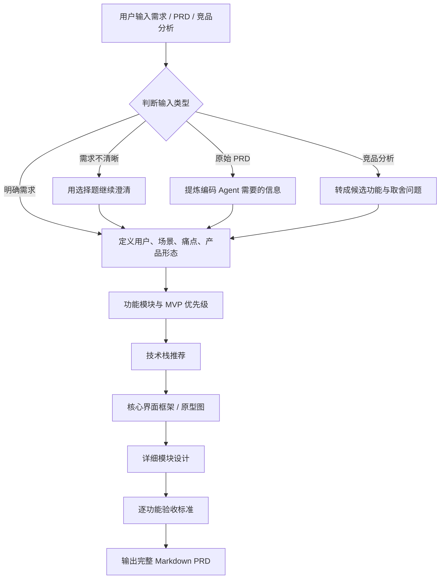
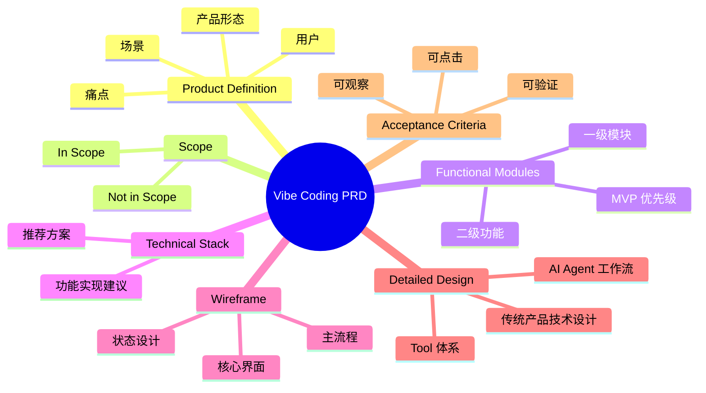

# Vibe Coding PRD Skill

> 把需求、原始 PRD、竞品分析或模糊想法，提炼成可以直接交给 Claude Code / Codex 的精简 PRD。


## 这个 Skill 解决什么

很多需求文档适合给人看，但不适合直接给编码 Agent 开工。这个 skill 会把材料压缩成编码 Agent 真正需要的信息：

| 输入材料 | Skill 会做什么 | 最终输出 |
|---|---|---|
| 明确需求 | 补全产品定义、功能范围、技术建议、验收标准 | 可开发 PRD |
| 原始 PRD | 去掉商业背景和冗余叙事，保留工程关键信息 | 精简 PRD |
| 竞品分析 | 提炼可借鉴功能，并让用户选择取舍 | MVP 功能方案 |
| 模糊想法 | 用选择题引导用户说清真实需求 | 澄清后的 PRD |

## 触发方式

在 Codex 中说：

```text
帮我写一个用来vibe coding的PRD
```

也可以这样使用：

```text
Use $vibe-coding-prd to turn this rough product idea into a PRD for Claude Code.
```

## 工作流



## 产出结构



## 安装

把仓库里的 `vibe-coding-prd` 文件夹复制到本地 Codex skills 目录：

```bash
mkdir -p ~/.codex/skills
cp -R vibe-coding-prd ~/.codex/skills/
```

安装后重启或刷新 Codex，即可通过触发语使用。

## 仓库结构

```text
.
├── README.md
└── vibe-coding-prd/
    ├── SKILL.md
    ├── agents/
    │   └── openai.yaml
    └── references/
        └── prd-template.md
```

## 设计原则

- 不替用户脑补需求，范围不清楚就先确认
- 用选择题帮助非技术用户表达真实需求
- PRD 保持精简，避免商业黑话和冗余背景
- 优先定义 MVP，明确哪些现在不做
- 技术栈用普通话解释，给出推荐而不是堆名词
- 验收标准必须可观察、可点击、可验证

## License

MIT
